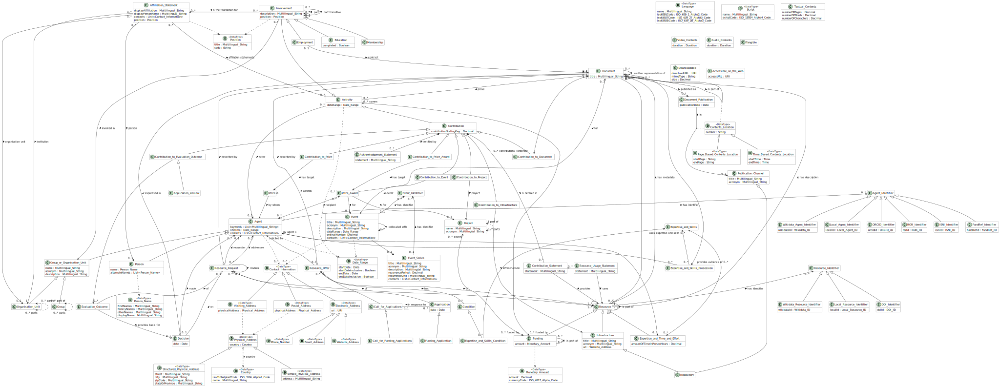

# CERIF Core
CERIF (=Common European Research Information Format) covers the domain of research information with a focus on the administrative and organizational aspects.
It aims to provide machine-processable representation of research information and cover situations where research information crosses borders between organizations (or between organizations and people).
This typically covers information interchanges between the Current Research Information Systems of these organizations, but other cases exist as well.
The information interchanged is not necessarily intended to be public.

## Overview
[Persons](./entities/Person.md), [Groups](./entities/Group.md) and [Organisation Units](./entities/Organisation_Unit.md) are [Agents](./entities/Agent.md).
Agents can perform [Activities](./entities/Activity.md).

Persons can act on their own, in affiliation to or on behalf of an Organisation Unit or a Group (optionally in their Position).
In the latter cases, an [Affiliation Statement](./entities/Affiliation_Statement.md) describes the connection. Multiple Affilation Statements are possible.

A Group can have any number of Agents as members (so we track [Memberships](./entities/Membership.md), one type of Activity).
If members of an Organisation Unit are to be represented, [Organisation Unit with Members](./entities/Organisation_Unit_with_Members.md) can be used.

Membership is a specific type of [Involvement](./entities/Involvement.md) in a [Group or Organisation Unit](./entities/Group_or_Organisation_Unit.md).
Other types are [Employment](./entities/Employment.md) and [Education](./entities/Education.md).
Involvements can reference a [Position Title](./entities/Position_Title.md) that describes the capacities of the involved Agent.

Research is typically carried out in [Projects](./entities/Project.md). 
Projects need [Resources](./entities/Resource.md), such as [Funding](./entities/Funding.md).
Bringing Resources of different kinds is a way how Agents can make [Contributions to Projects](./entities/Contribution_to_Project.md).

Scientific and other [Events](./entities/Event.md) support communication, including scholarly communication. 
Agents can make different [Contributions to Events](./entities/Contribution_to_Event.md).

Information and knowledge are typically stored in [Documents](./entities/Document.md), for instance [Textual Documents](./entities/Textual_Document.md).
Agents can make different [Contributions to Documents](./entities/Contribution_to_Document.md), most notably that of [Authorship](./entities/Authorship.md).
Accessibility of Documents is a pressing issue, so it can be expressed in [Textual Document Accessibility Specifications](./entities/Textual_Document_Accessibility_Specification.md).

Agents prepare and submit [Applications](./entities/Application.md), for instance [Funding Applications](./entities/Funding_Application.md).
This can occur in response to a [Call for Applications](./entities/Call_for_Applications.md), for instance a [Call for Funding Applications](./entities/Call_for_Funding_Applications.md), or outside of any such call, perhaps based on an implicit invitation to do so.
Once submitted, an application, will go through some kind of evaluation process and in the end there will be a [Decision](./entities/Decision.md).
On the way to it there may be [Evaluation Outcomes](./entities/Evaluation_Outcome.md).
Agents can make [Contributions to Evaluation Outcomes](./entities/Contribution_to_Evaluation_Outcome.md), most notably by doing the [Application_Review](./entities/Application_Review.md).

All the contributions mentioned above are subclasses of [Contribution](./entities/Contribution.md).
A Contribution is another type of Activity.
Contributions can be detailed with any number of [Contribution Statements](./entities/Contribution_Statement.md).
These can in turn be further refined with [Resource Usage Statements](./entities/Resource_Usage_Statement.md) which represent the fact of a Resource being used for the Activity.

[Expertise or Skills](../entities/Expertise_and_Skills.md) can be [posesses](../entities/Expertise_and_Skills_Posession.md) by Agents 
or they can be [conditions](../entities/Expertise_and_Skills_Condition.md) for a [Resource Offer](../entities/Resource_Offer.md).
But a Resource Offer can specify any other [Conditions](../entities/Condition.md), too.

Opposite to a Resource Offer, we can also have a [Resource Request](../entities/Resource_Request.md).
Calls for Application are one example of Resource Requests.

[Prizes](./entities/Prize.md) are conferred on Agents in [Prize Awards](./entities/Prize_Award.md).

## Listings

### Entities
* [Agent](./entities/Agent.md)
  * [Person](./entities/Person.md)
  * [Organisation Unit](./entities/Organisation_Unit.md), [Group](./entities/Group.md) (or [Group_or_Organisation_Unit](./entities/Group_or_Organisation_Unit.md) to represent the union of these two, or [Organisation Unit with Members](./entities/Organisation_Unit_with_Members.md) to represent the intersection of these two)
* [Activity](./entities/Activity.md)
  * [Contribution](./entities/Contribution.md)
    * [Contribution to Document](./entities/Contribution_to_Document.md)    
      * [Authorship](./entities/Authorship.md)
    * [Contribution to Project](./entities/Contribution_to_Project.md)
    * [Contribution to Event](./entities/Contribution_to_Event.md)
    * [Contribution to Evaluation Outcome](./entities/Contribution_to_Evaluation_Outcome.md)
      * [Application Review](./entities/Application_Review.md)
  * [Involvement](./entities/Involvement.md)
    * [Membership](./entities/Membership.md)
    * [Employment](./entities/Employment.md)
    * [Education](./entities/Education.md)
* [Position_Title](./entities/Position_Title.md)
* [Document](./entities/Document.md)
  * [Textual Document](./entities/Textual_Document.md)
* [Affiliation](./entities/Affiliation_Statement.md)
* [Contribution Statement](./entities/Contribution_Statement.md)
* [Textual Document Accessibility Specification](./entities/Textual_Document_Accessibility_Specification.md)
* [Project](./entities/Project.md)
* [Event](./entities/Event.md)
* [Resource](./entities/Resource.md)
  * [Funding](./entities/Funding.md)
* [Resource Offer](../entities/Resource_Offer.md)
* [Resource Request](../entities/Resource_Request.md)
* [Resource Usage Statement](./entities/Resource_Usage_Statement.md)
* [Condition](./entities/Condition.md)
* [Call for Applications](./entities/Call_for_Applications.md)
  * [Call for Funding Applications](./entities/Call_for_Funding_Applications.md)
* [Application](./entities/Application.md)
  * [Funding Application](./entities/Funding_Application.md) 
* [Evaluation Outcome](./entities/Evaluation_Outcome.md)
* [Decision](./entities/Decision.md) 	
* [Prize](./entities/Prize.md)
* [Prize Award](./entities/Prize_Award.md)
* [Expertise and Skills](./entities/Expertise_and_Skills.md)
* [Expertise and Skills Condition](./entities/Expertise_and_Skills_Condition.md)
* [Expertise and Skills Posession](./entities/Expertise_and_Skills_Posession.md)

### Data Types
* [String](./datatypes/String.md)
* [Date](./datatypes/Date.md), [Date Range](./datatypes/Date_Range.md)
* [Boolean](./datatypes/Boolean.md)
* [Decimal](./datatypes/Decimal.md)
* [Multilingual String](./datatypes/Multilingual_String.md)
* [ORCID iD Type](./datatypes/ORCID_iD.md)
* [ROR ID Type](./datatypes/ROR_ID.md)
* [URI Type](./datatypes/URI.md)
* [DOI Type](./datatypes/DOI.md)
* [Fundref ID Type](./datatypes/Fundref_ID.md)
* [ISNI ID Type](./datatypes/ISNI_ID.md)
* [Wikidata ID Type](./datatypes/Wikidata_ID.md)
* [Person Name](./datatypes/Person_Name.md)
* [Postal Address](./datatypes/Postal_Address.md)
* [Language](./datatypes/Language.md), [Country](./datatypes/Country.md), [Script](./datatypes/Script.md)
* [Language Tag](./datatypes/Language_Tag.md)
* [Monetary Amount](./datatypes/Monetary_Amount.md)
* Codes for languages: [ISO 639-1 Alpha2 Code](./datatypes/ISO_639_1_Alpha2_Code.md), [ISO 639-2B Alpha3 Code](./datatypes/ISO_639_2B_Alpha3_Code.md), [ISO 639-2T Alpha3 Code](./datatypes/ISO_639_2T_Alpha3_Code.md)
* Codes for countries: [ISO 3166 Alpha2 Code](./datatypes/ISO_3166_Alpha2_Code.md)
* Codes for currencies: [ISO 4217 Alpha Code](./datatypes/ISO_4217_Alpha_Code.md)
* Codes for scripts: [ISO 15924 Alpha4 Code](./datatypes/ISO_15924_Alpha4_Code.md)

## Illustrative Diagram

## Usage
The Core is seldom used on its own, one almost always needs to add one or several additional modules.
We include the following example:
* [Person](./examples/Person_Example1.md)

## Status
This is the experimental Core of CERIF, 
the result of the [CERIF Refactoring Pilot](https://www.eurocris.org/cerif-refactoring-project-introduction) project 
started in 2021 by [euroCRIS](https://www.eurocris.org/).
The scope, structure or any other aspect can change.
It has not been approved as the official standard yet.

## Development
We follow some [guidelines](./guidelines#cerif-guidelines) and use some [tools](./tools#cerif-core-tools).