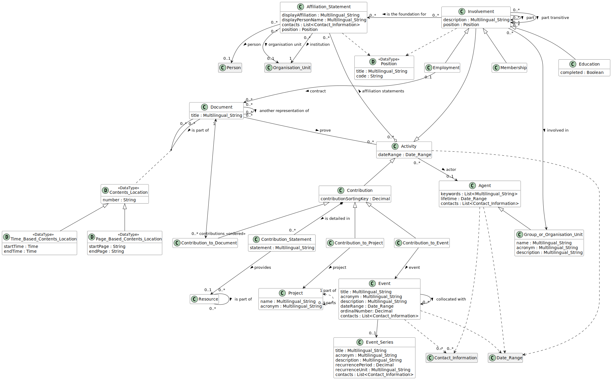

# Activity

## Definition
Anything an Agent does.

## Usage notes
This records any research-related activity of an [Agent](../entities/Agent.md) (i.e., [Person](../entities/Person.md), [Organization](../entities/Organisation_Unit.md) or a [Group](../entities/Group.md)). Activities represent [Contributions](../entities/Contribution.md) to different things (to [Projects](../entities/Contribution_to_Project.md), [Events](../entities/Contribution_to_Event.md), [Documents](../entities/Contribution_to_Document.md), ...) or [Memberships](../entities/Membership.md) in [Groups](../entities/Group.md).

## Attributes

start date: [Date](../datatypes/Date.md)

end date: [Date](../datatypes/Date.md)

## Relationships
<a name="rel__actor">An Activity typically has the *[actor](../entities/Agent.md#user-content-rel__activity)*: an instance of [Agent](../entities/Agent.md).</a> For some subclasses of Activity, the Agent may not be known or disclosed (e.g. for blind reviews). Also if the actor uses a pseudonym, their identity (and sometimes event the type) are unknown, in which case just the display name is available.</a>

<a name="rel__has-affiliation-statements">An Activity *[has](../entities/Affiliation.md#user-content-rel__is-used-in)* any number of [Affiliations](../entities/Affiliation.md).</a>

[comment]: # (TODO: Proof of the activity)

## Illustrative Diagram

---
## Matches

## References
