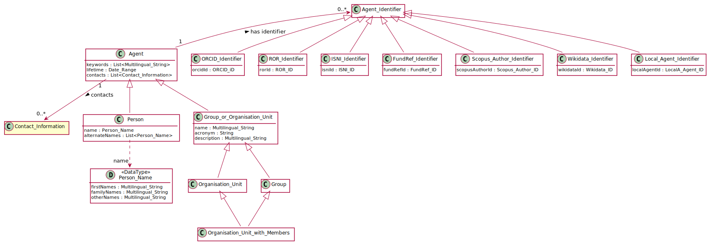

# Agent

## Definition

Anything that has the ability to perform actions.

## Usage notes

Currently either [Person](../entities/Person.md) 
or [Organisation Unit](../entities/Organisation_Unit.md),
for future extension.

## Attributes

ISNI ID: [ISNI ID Type](../datatypes/ISNI_ID.md)

Wikidata ID: [Wikidata ID Type](../datatypes/Wikidata_ID.md)

## Relationships

<a name="relc4c92595-4f3d-43a3-8041-fd86fface421">An Agent can have any number of *[contributorships](Contributorship_to_Document.md#user-content-relc4c92595-4f3d-43a3-8041-fd86fface421)*: instances of [Contributorship](Contributorship_to_Document.md).</a>

(FIXME)

## Illustrative Diagram

---
## Matches
1. Close match of [FOAF Agent](http://xmlns.com/foaf/spec/#term_Agent) 
