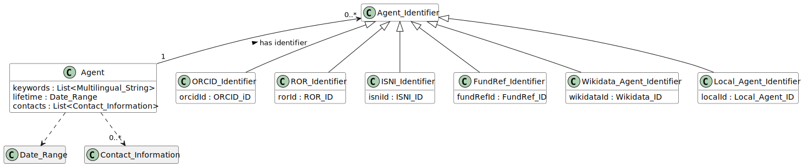

# Agent Identifier

## Definition
An identifier that is assigned to an [Agent](../entities/Agent.md).

## Attributes

## Relationships

<a name="rel__is-assigned-to">is-assigned-to</a> / [has-identifier](../entities/Agent.md#user-content-rel__has-identifier) : An Agent Identifier is assigned to an [Agent](../entities/Agent.md).

## Illustrative Diagram

---
## References
<a name="fn1">\[1\]</a> Source: ...
