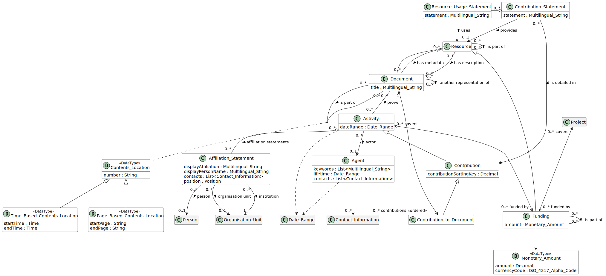

# Contribution to Document

## Definition
Any contribution an [Agent](../entities/Agent.md) made to a [Document](../entities/Document.md).

## Usage notes

## Attributes
Those inherited from [Contribution](../entities/Contribution.md#attributes)

## Relationships
Beside those inherited from [Contribution](../entities/Contribution.md#relationships):

<a name="rel__has-target">has-target</a> / [has-contribution](../entities/Document.md#user-content-rel__has-contribution) : A Contribution to Document always references the target [Document](../entities/Document.md).

## Illustrative Diagram

---
## Matches
Roughly similar to ContributionSituation from SCoRO.[1](#fn1)

## References
<a name="fn1">\[1\]</a> David Shotton, Silvio Peroni: *SCoRO, the Scholarly Contributions and Roles Ontology.* Available: http://purl.org/spar/scoro/2017-09-04
