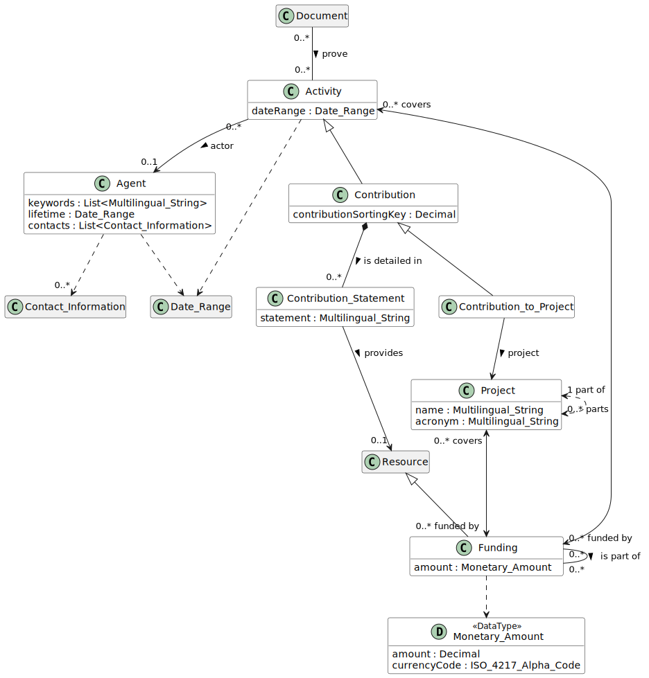

# Contribution to Project

## Definition
Any contribution an [Agent](../entities/Agent.md) made to a [Project](../entities/Resource.md).

## Usage notes

## Attributes

Those inherited from [Contribution](../entities/Contribution.md#attributes)

## Relationships

Beside those inherited from [Contribution](../entities/Contribution.md#relationships), a Contribution to Project always has the *[project](../entities/Resource.md)*: an instance of [Project](../entities/Resource.md).

<a name="rel__has-target">has-target</a> / [has-contribution](../entities/Project.md#user-content-rel__has-contribution) : A Contribution to Project always references the target [Project](../entities/Project.md).

## Illustrative Diagram

---
## Matches

## References
