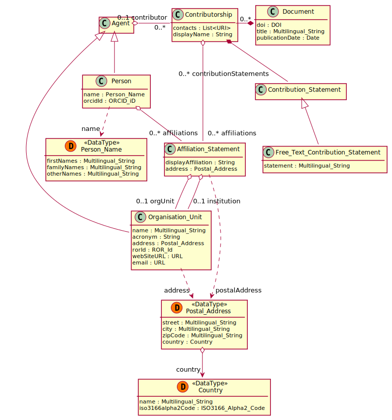

# Contributorship

## Definition
Any contribution an [Agent](../entities/Agent.md) made to a [Document](../entities/Document.md).

## Usage notes

## Attributes

contacts: List<[URI](../datatypes/URI.md)>

display name: [String](../datatypes/String.md)>

## Relationships

<a name="relc4c92595-4f3d-43a3-8041-fd86fface421">A Contributorship typically has the *[contributor](../entities/Agent.md#user-content-relc4c92595-4f3d-43a3-8041-fd86fface421)*: an instance of [Agent](../entities/Agent.md).</a> For some subclasses of Contributorship, the Agent may not be known (e.g. for blind reviews). Also if the contributor uses a pseudonym, their identity (and sometimes event the type) are unknown, in which case just the display name is available.

<a name="relab1878d2-60c9-47cb-bac9-09b3b91aa89c">A Contributorship always has the *[document](../entities/Document.md#user-content-relab1878d2-60c9-47cb-bac9-09b3b91aa89c)*: an instance of [Document](../entities/Document.md).</a>

A Contributorship has any number of *affiliations*: instances of [Affiliation Statement](../entities/Affiliation_Statement.md).

A Contributorship has any number of *contribution statements*: instances of [Contribution Statement](../entities/Contribution_Statement).

## Illustrative Diagram

---
## Matches
Roughly similar to ContributionSituation from SCoRO.[1](#fn1)

## References
<a name="fn1">\[1\]</a> David Shotton, Silvio Peroni: *SCoRO, the Scholarly Contributions and Roles Ontology.* Available: http://purl.org/spar/scoro/2017-09-04
