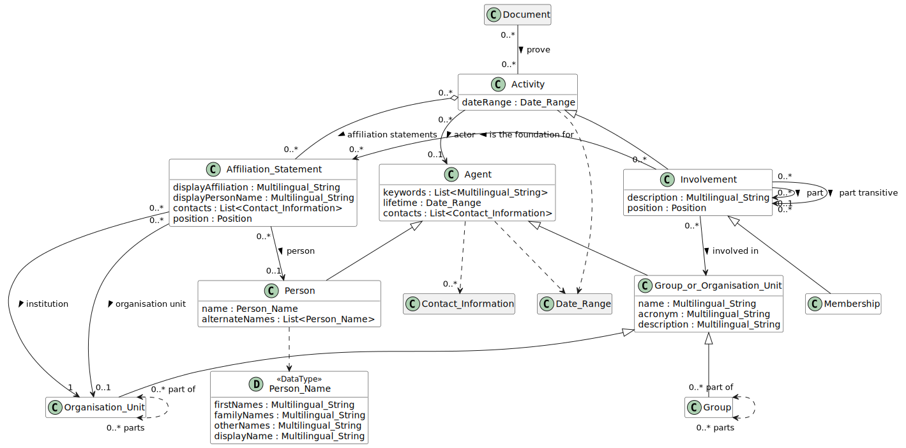

# Membership

## Definition
Membership of an [Agent](../entities/Agent.md) into a [Group](../entities/Group.md) or [Association or Society](Association_or_Society.md).

## Usage notes

## Specialization of
[Activity](../entities/Activity.md)

## Attributes

Besides those inherited from [Activity](../entities/Activity.md#attributes), a membership has the following attributes:

date of joining ...

## Relationships

Beside those inherited from [Activity](../entities/Activity.md#relationships), a Membership always has the *[Group](../entities/Group.md)*: an instance of [Group](../entities/Group.md) or a subclass such as [Association or Society](Association_or_Society.md). 

## Illustrative Diagram

---
## Matches

## References