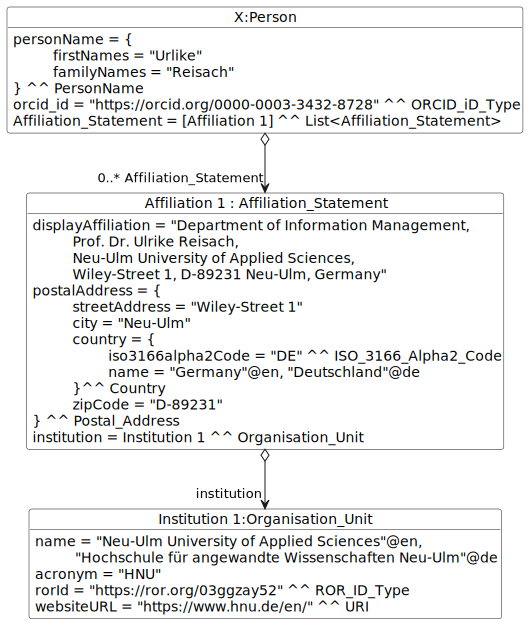

# Examples of usage for CERIF Scholarly Publications Module

The module includes the following examples:
* [Person](#person-example)

## Person Example

### Description
The example provides representation of the following researcher in the CERIF format by using [Person entity](../entities/Person.md) and associate entities:

````
Ulrike Reisach
https://orcid.org/0000-0003-3432-8728
Department of Information Management, 
Prof. Dr. Ulrike Reisach, 
Neu-Ulm University of Applied Sciences, 
Wiley-Street 1, D-89231 Neu-Ulm, Germany
````


## Illustrative diagram



## Serialization

[Person Example serialization](01_Person/example01.ttl)